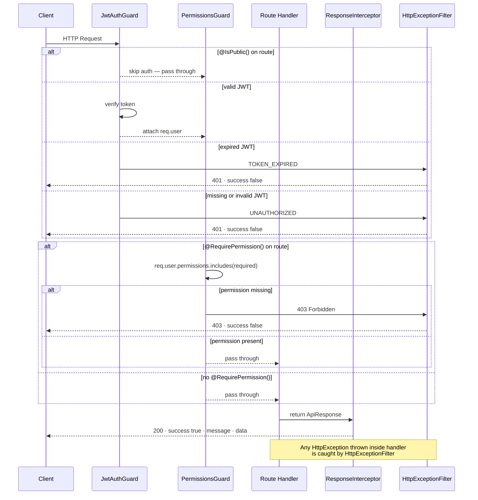

# ⚙️ Core — Business

Technical reference: [core.tech.md](./core.tech.md)

---
---

## Business

Cross-cutting infrastructure applied globally to every request in the application.
Nothing in `core/` is feature-specific — it defines how all requests are protected, processed, and responded to.

---

### Request Lifecycle

Every request passes through guards → handler → interceptor. Exceptions at any point go to the filter.

---

### Auth Model

- Every route is protected by default — authentication and permission checks run globally
- Routes opt out of auth with `@IsPublic()`, not the other way around
- Permission requirements are declared per-route with `@RequirePermission('module:action')`
- Permissions are embedded in the JWT at login — no DB lookup per request

---

### Response Contract

All responses follow one consistent shape regardless of which module produced them:

**Success:** `{ success: true, message, data }`
**Error:** `{ success: false, message, data: null }`

Consumers never receive raw NestJS errors or unformatted exceptions.

---
---

## Planned

### Business

- **Optional auth** — future routes that serve both guests and authenticated users differently (e.g. public product listing enriched with wishlist state for logged-in users)
