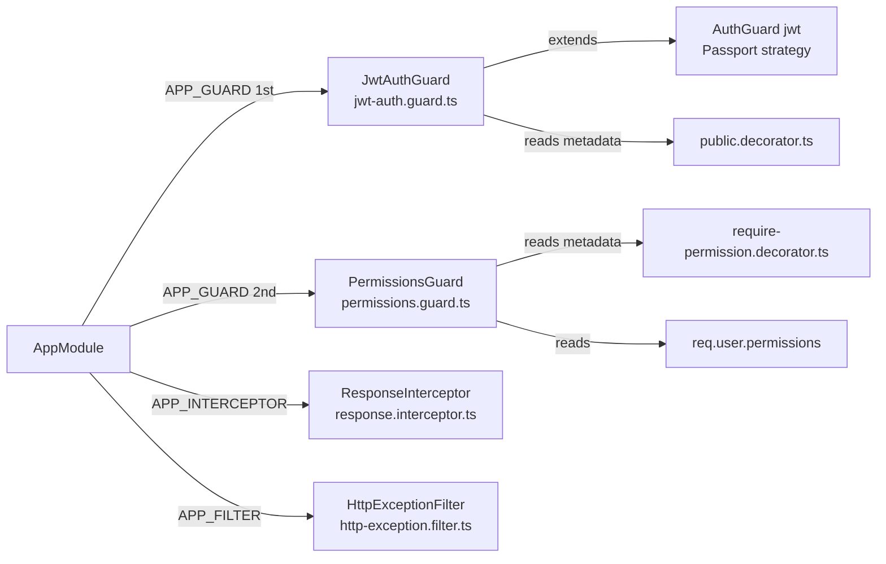
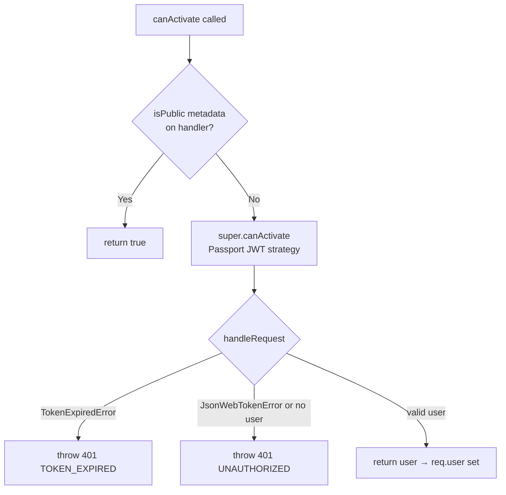

# ⚙️ Core — Technical

Business reference: [core.md](./core.md)

---
---

## Technical

### Global Registration

All pieces are registered in `AppModule` as global providers:

```typescript
{ provide: APP_GUARD,       useClass: JwtAuthGuard }
{ provide: APP_GUARD,       useClass: PermissionsGuard }
{ provide: APP_INTERCEPTOR, useClass: ResponseInterceptor }
{ provide: APP_FILTER,      useClass: HttpExceptionFilter }
```



---

### Guards

#### JwtAuthGuard

Authenticates every request using the JWT in the `Authorization: Bearer` header.
Extends NestJS `AuthGuard('jwt')` which runs the Passport JWT strategy.

**Skip with `@IsPublic()`** — if the route handler has `@IsPublic()` metadata → `canActivate` returns `true` immediately. No token is inspected.

| Scenario | Response |
|---|---|
| Token expired | `401 TOKEN_EXPIRED` |
| Token invalid / missing | `401 UNAUTHORIZED` |
| `@IsPublic()` route | Always passes through |



---

#### PermissionsGuard

Checks that the authenticated user holds the permission declared on the route via `@RequirePermission()`.
Reads permissions from `req.user.permissions` — the array embedded in the JWT payload at login.

- No `@RequirePermission()` on route → returns `true` immediately
- `@RequirePermission('x:y')` present → `user.permissions.includes('x:y')`
- Permission missing → returns `false` → NestJS throws `403 Forbidden`

Runs **after** `JwtAuthGuard`. `req.user` is guaranteed to exist by the time it runs (except on `@IsPublic()` routes — but those have no `@RequirePermission()` anyway).

---

### Decorators

#### `@IsPublic()`

```typescript
export const IsPublic = () => SetMetadata('isPublic', true);
```

Sets `isPublic = true` metadata on a route handler. Read by `JwtAuthGuard`.

Do not overload this for optional auth — add a separate `@IsOptionalAuth()` decorator for that case.

---

#### `@RequirePermission(permission)`

```typescript
export const RequirePermission = (value: string) => SetMetadata('permission', value);
```

Sets a `permission` metadata string on a route handler. Read by `PermissionsGuard`.
Value must match a permission name registered in the `permissions` table (e.g. `'categories:create'`).

---

### Response Shape

#### `ApiResponse<T>`

Internal class returned by all service methods:

```typescript
class ApiResponse<T> {
  message: string;
  data: T | null;

  constructor(message: string, data: T | null = null) {}
}
```

Services return `new ApiResponse('Some message', payload)`.
`ResponseInterceptor` transforms it into the final client-facing shape.

---

#### `ResponseInterceptor`

Wraps every successful response:

```json
{
  "success": true,
  "message": "Category created successfully",
  "data": {}
}
```

If `data` is not provided → `null`. If `message` is missing → `"Success"`.

---

#### `HttpExceptionFilter`

Catches all `HttpException` throws (400, 401, 403, 404, 409, etc.) and formats them consistently:

```json
{
  "success": false,
  "message": "Category not found",
  "data": null
}
```

Message extraction: if the exception response is an object with a `message` field → uses that value (supports class-validator's array of messages too). Otherwise → uses `exception.message` directly.

---

### File Structure

```
src/core/
├── decorators/
│   ├── public.decorator.ts               @IsPublic()
│   └── require-permission.decorator.ts   @RequirePermission()
│
├── guards/
│   ├── jwt-auth.guard.ts                 JWT authentication — global
│   └── permissions.guard.ts              Permission check — global
│
├── interceptors/
│   └── response.interceptor.ts           Wraps success responses — global
│
├── filters/
│   └── http-exception.filter.ts          Formats error responses — global
│
└── responses/
    └── api-response.ts                   ApiResponse<T> class used by all services
```

---

### Gotchas

**Guards Run in Registration Order** — `JwtAuthGuard` is registered before `PermissionsGuard` in `AppModule`. Order matters — permissions check depends on `req.user` being set first.

**`PermissionsGuard` Does Not Run on `@IsPublic()` Routes — But Safely** — `@IsPublic()` routes skip `JwtAuthGuard`, so `req.user` is `undefined`. `PermissionsGuard` still runs but since `@IsPublic()` routes never have `@RequirePermission()`, it hits the early return and passes through safely.

**class-validator Errors Are Auto-Formatted** — When a DTO validation fails, NestJS throws a `BadRequestException` with an array of messages. `HttpExceptionFilter` handles this — the `message` field in the response will be that array. This means `message` can be `string | string[]` — planned to standardize to always `string[]`.

---
---

## Planned

### Technical

- `@IsOptionalAuth()` decorator — for future routes that serve both guests and logged-in users differently without requiring authentication
- Standardize error `message` to always be `string[]` — `HttpExceptionFilter` should wrap single strings in an array so the CRM and any future consumer never needs to branch on `typeof message`
