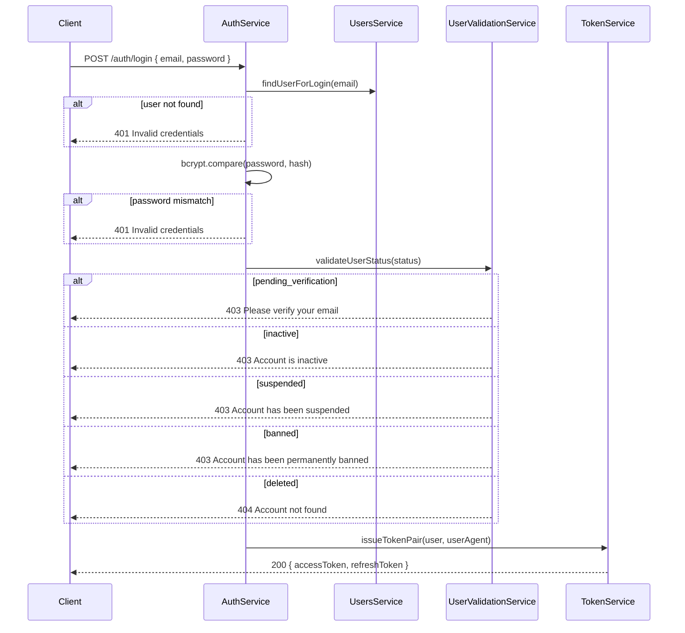
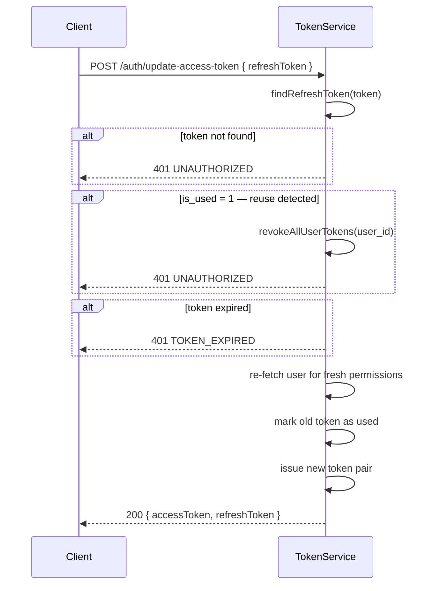

# 🔐 Auth — Business

Technical reference: [auth.tech.md](./auth.tech.md)

---
---

## Business

### What It Does

Handles login and token management. Returns a **JWT access token** and a **refresh token** on login. The refresh token exchanges for a new pair without re-entering credentials.

---

### Login Flow

---

### Token Refresh Flow

---

### Blocked Statuses

Users with these statuses **cannot log in**:

| Status | HTTP | Message |
|---|---|---|
| `pending_verification` | 403 | Please verify your email before logging in |
| `inactive` | 403 | Account is inactive. Please contact support |
| `suspended` | 403 | Account has been suspended. Please contact support |
| `banned` | 403 | Account has been permanently banned |
| `deleted` | 404 | Account not found |

---

### Security Decisions

**No user enumeration** — both "email not found" and "wrong password" return the same `401 Invalid credentials`.

**`deleted` returns 404, not 403** — a deleted user who provides correct credentials gets `404 Account not found`. This intentionally obscures that the account ever existed.

**Blocked status messages are descriptive** — once a user proves they own the account (correct credentials), the email's existence is no longer a secret. Descriptive 403 messages are acceptable at that point.

**Token reuse detection** — if a refresh token that was already used is submitted again, ALL tokens for that user are immediately revoked. This signals a replay attack or stolen token. Killing all sessions is intentional.

**Permissions are snapshotted at login** — role/permission changes do not take effect until the user re-logs in and gets a new token.

---
---

## Planned

### Business

- **Logout** — operator or user can explicitly end their session
