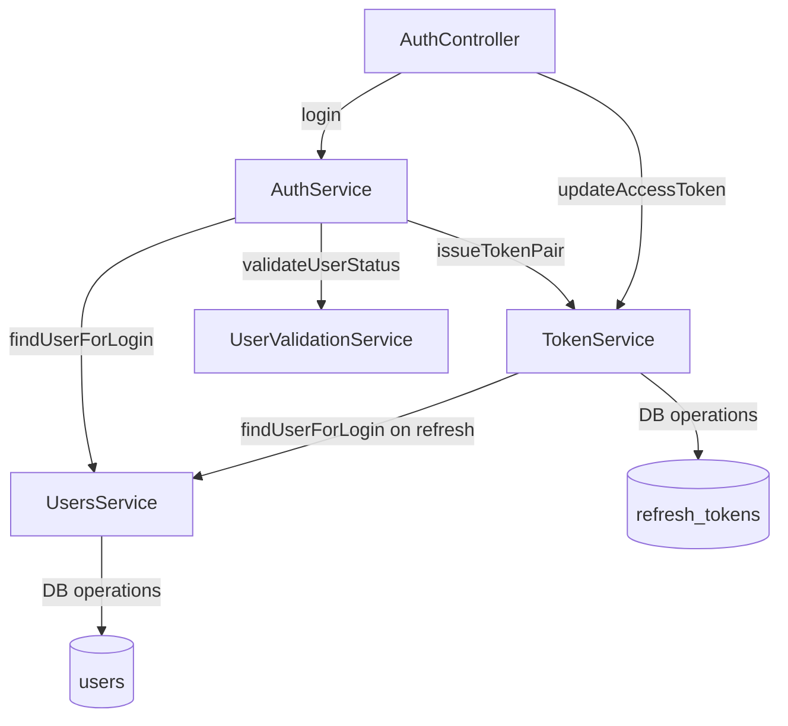
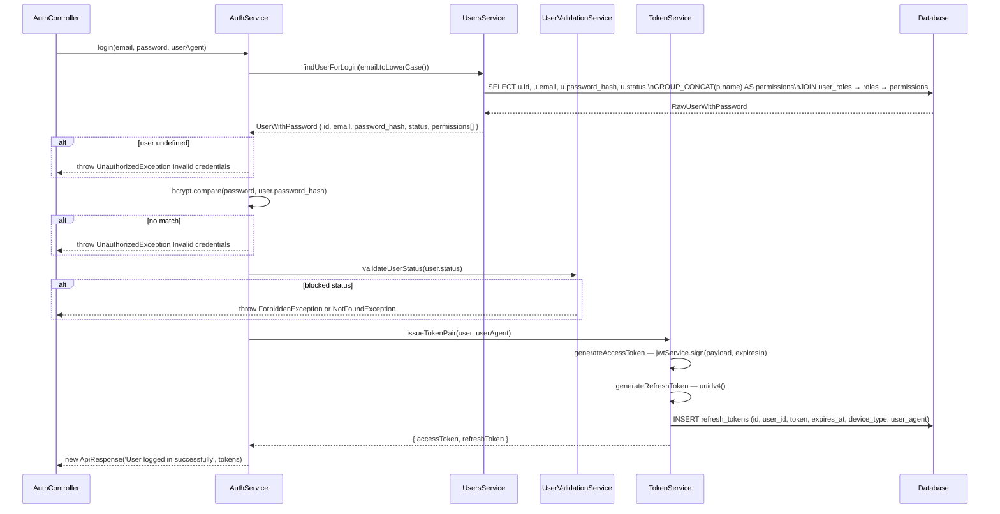
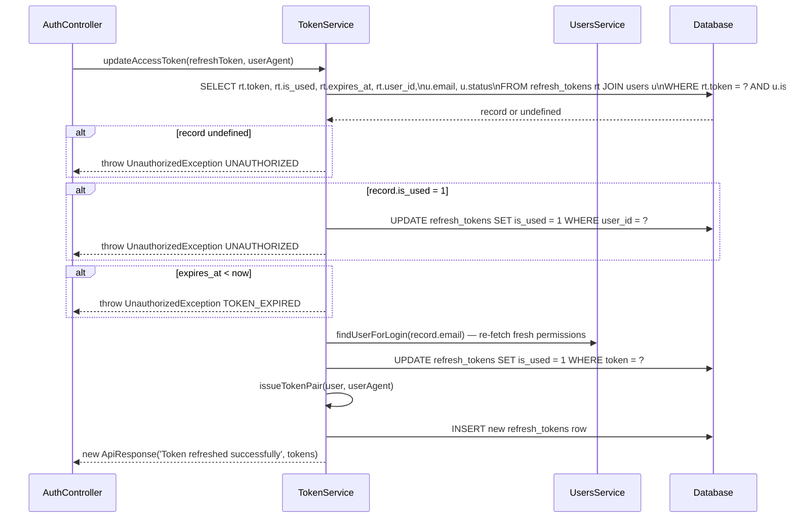
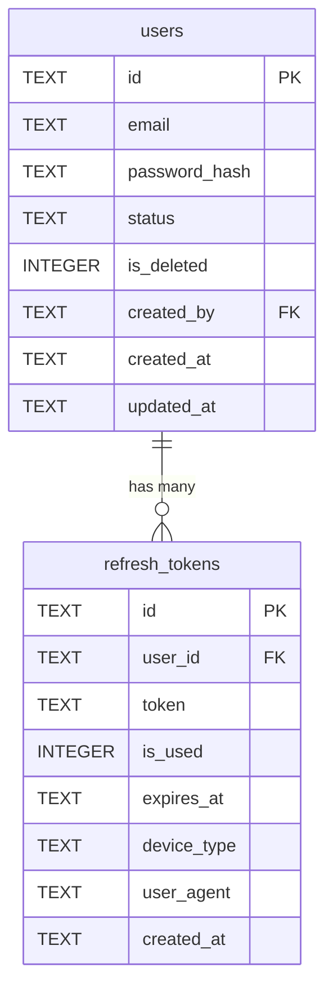

# 🔐 Auth — Technical

Business reference: [auth.md](./auth.md)

---
---

## Technical

### Endpoints

| Method | Path | Access |
|---|---|---|
| `POST` | `/auth/login` | Public |
| `POST` | `/auth/update-access-token` | Public |

Both use `@IsPublic()` — the global `JwtAuthGuard` skips them entirely. See [core.tech.md](../../core/docs/core.tech.md) for guard and decorator internals.

---

### Service Dependency

`AuthController` injects both `AuthService` (for login) and `TokenService` (for token refresh) directly.



---

### DTOs

#### `LoginDto`

| Field | Type | Required |
|---|---|---|
| `email` | string | Yes |
| `password` | string | Yes |

#### `UpdateAccessTokenDto`

| Field | Type | Required | Notes |
|---|---|---|---|
| `refreshToken` | string | Yes | Plain UUID |

---

### Login Flow (detailed)



---

### Token Refresh Flow (detailed)



---

### Access Token

**Format:** JWT signed with `JWT_SECRET`.
**Expiry:** `ACCESS_TOKEN_EXPIRY` in `token.constants.ts`

**Payload:**
```typescript
{
  sub: string           // user id
  email: string
  status: string
  permissions: string[] // e.g. ['users:create', 'categories:read']
}
```

---

### Refresh Token

**Format:** Plain UUID (not a JWT).
**Expiry:** `REFRESH_TOKEN_EXPIRY_MS` in `token.constants.ts`

---

### Examples

#### `POST /auth/login`

**Request:**
```json
{
  "email": "admin@example.com",
  "password": "secret123"
}
```

**200 — success:**
```json
{
  "success": true,
  "message": "User logged in successfully",
  "data": {
    "accessToken": "eyJhbGciOiJIUzI1NiIsInR5cCI6IkpXVCJ9...",
    "refreshToken": "550e8400-e29b-41d4-a716-446655440000"
  }
}
```

**401 — wrong credentials:**
```json
{
  "success": false,
  "message": "Invalid credentials",
  "data": null
}
```

**403 — blocked account:**
```json
{
  "success": false,
  "message": "Account has been suspended. Please contact support",
  "data": null
}
```

---

#### `POST /auth/update-access-token`

**Request:**
```json
{
  "refreshToken": "550e8400-e29b-41d4-a716-446655440000"
}
```

**200 — success:**
```json
{
  "success": true,
  "message": "Token refreshed successfully",
  "data": {
    "accessToken": "eyJhbGciOiJIUzI1NiIsInR5cCI6IkpXVCJ9...",
    "refreshToken": "7c9e6679-7425-40de-944b-e07fc1f90ae7"
  }
}
```

**401 — token reused or not found:**
```json
{
  "success": false,
  "message": "UNAUTHORIZED",
  "data": null
}
```

**401 — token expired:**
```json
{
  "success": false,
  "message": "TOKEN_EXPIRED",
  "data": null
}
```

---

### Database



---

### Environment Variables

| Variable | Notes |
|---|---|
| `JWT_SECRET` | Required. App throws on startup if missing. |

---

### File Structure

```
src/modules/auth/
├── auth.controller.ts          injects AuthService + TokenService
├── auth.module.ts
├── auth.service.ts             login flow
├── auth.service.spec.ts
├── jwt.strategy.ts             JwtPayload type lives here
│
├── dto/
│   ├── login.dto.ts
│   └── update-access-token.dto.ts
│
├── modules/token/
│   ├── token.service.ts        updateAccessToken + issueTokenPair
│   ├── token.service.spec.ts
│   └── token.constants.ts      ACCESS_TOKEN_EXPIRY, REFRESH_TOKEN_EXPIRY_MS
│
└── types/
    └── auth.types.ts           UserWithPassword, RawUserWithPassword
```

---

### Gotchas

**`device_type` Is Heuristic** — Derived from regex on user-agent string — not authoritative.

**`AuthController` Bypasses `AuthService` for Token Refresh** — `updateAccessToken` is called directly on `TokenService`, not through `AuthService`. `AuthService` only handles login.

**`deleted` Status Throws 404 Not 403** — `UserValidationService` throws `NotFoundException` for `deleted` status and `ForbiddenException` for all other blocked statuses. See business doc.

---
---

## Planned

### Technical

- `POST /auth/logout` — mark all of the user's refresh tokens as `is_used = 1`
- Add cross-module dependency section — document the `UsersService.findUserForLogin` boundary (called by both `AuthService` at login and `TokenService` at refresh)
