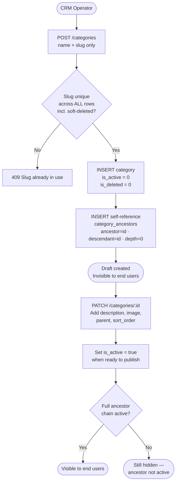
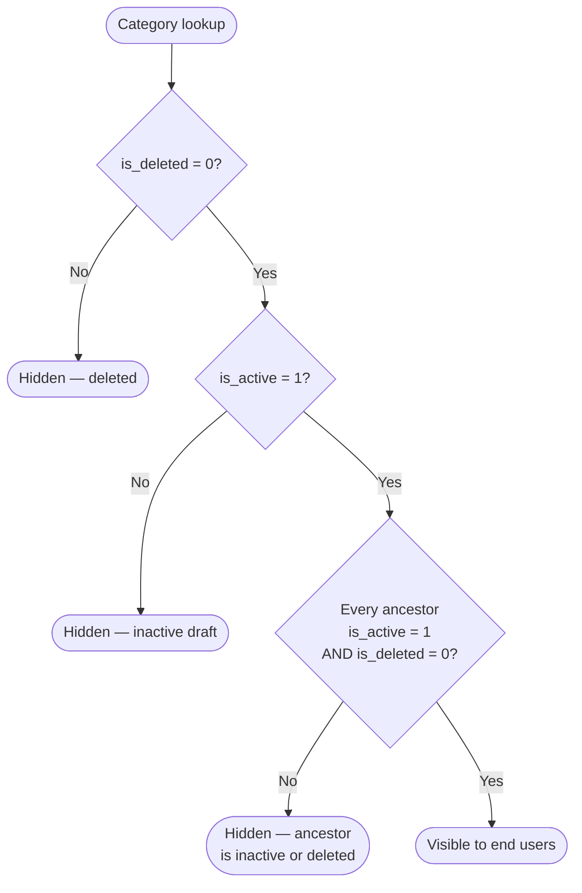
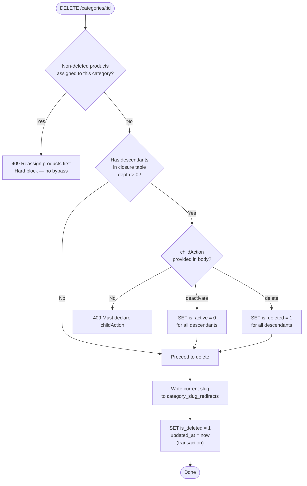

# 🏷️ Categories — Business

Technical reference: [categories.tech.md](./categories.tech.md)

---
---

## Business

### What It Does

Manages the product category tree. Categories are hierarchical (e.g. Electronics → Phones → Smartphones).

---

### Two-Step Creation Workflow

Category creation is deliberately split to prevent CRM users from accidentally publishing incomplete categories.

> `isActive` and `parentId` are intentionally absent from the create DTO — they can only be set via PATCH.

---

### Visibility Rule

> A category is only visible if **it and all its ancestors** are `is_active = 1` and `is_deleted = 0`.

Enforced at query time via the closure table. No cascade writes on the DB.

---

### Soft Delete

`is_deleted = 1` permanently hides the category. One-way — cannot be undone via the API.

---

### Product Assignment Rule

Products can be assigned to both **active** and **inactive** categories. Assignment is only blocked if the category is **deleted** (`is_deleted = 1`).

---

### Parent Eligibility

When assigning or changing a parent via `parentId`:

- If the category being moved is **active** → new parent must be `is_deleted = 0` AND `is_active = 1`
- If the category being moved is **inactive** → new parent must only be `is_deleted = 0`

This allows operators to build chains of inactive categories and activate them all at once when ready.

---

### Delete Guards

---
---

## Planned

### Business

- **`PATCH /categories/:id`** — operators can update name, description, image, sort order, assign a parent, and activate/deactivate a category
- **`DELETE /categories/:id`** — safe deletion with product reassignment guard and child cascade options
- **Public storefront endpoint** — only returns categories where the full ancestor chain is active and non-deleted
- **Slug redirects** — old slugs redirect to the current category for SEO continuity after renames or deletes
