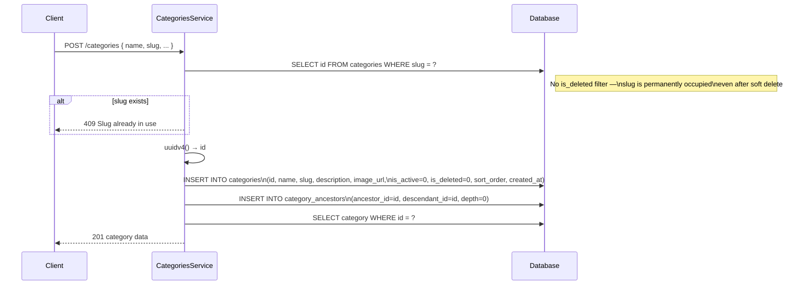
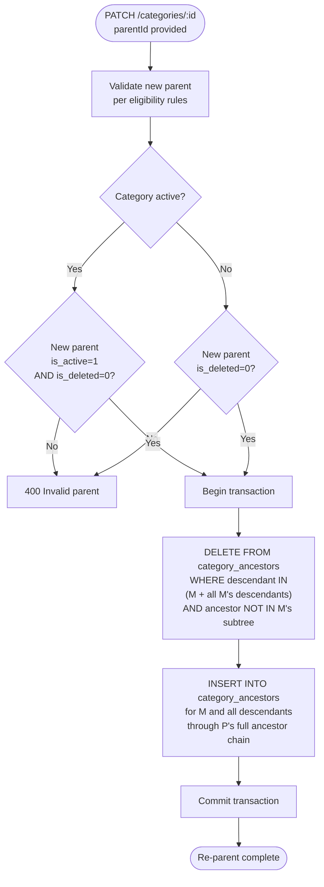
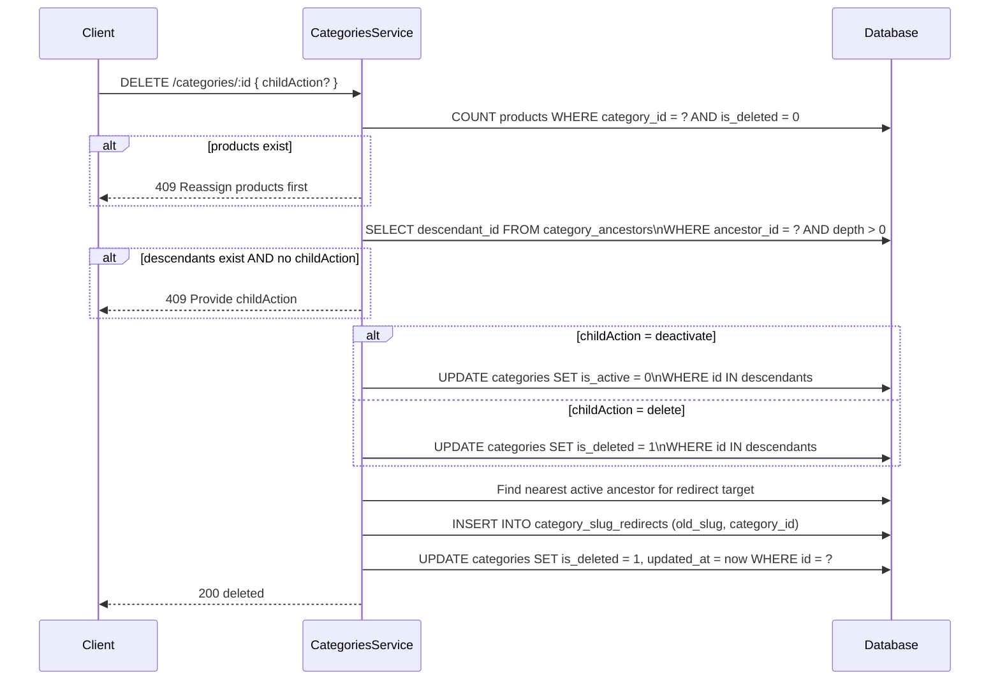
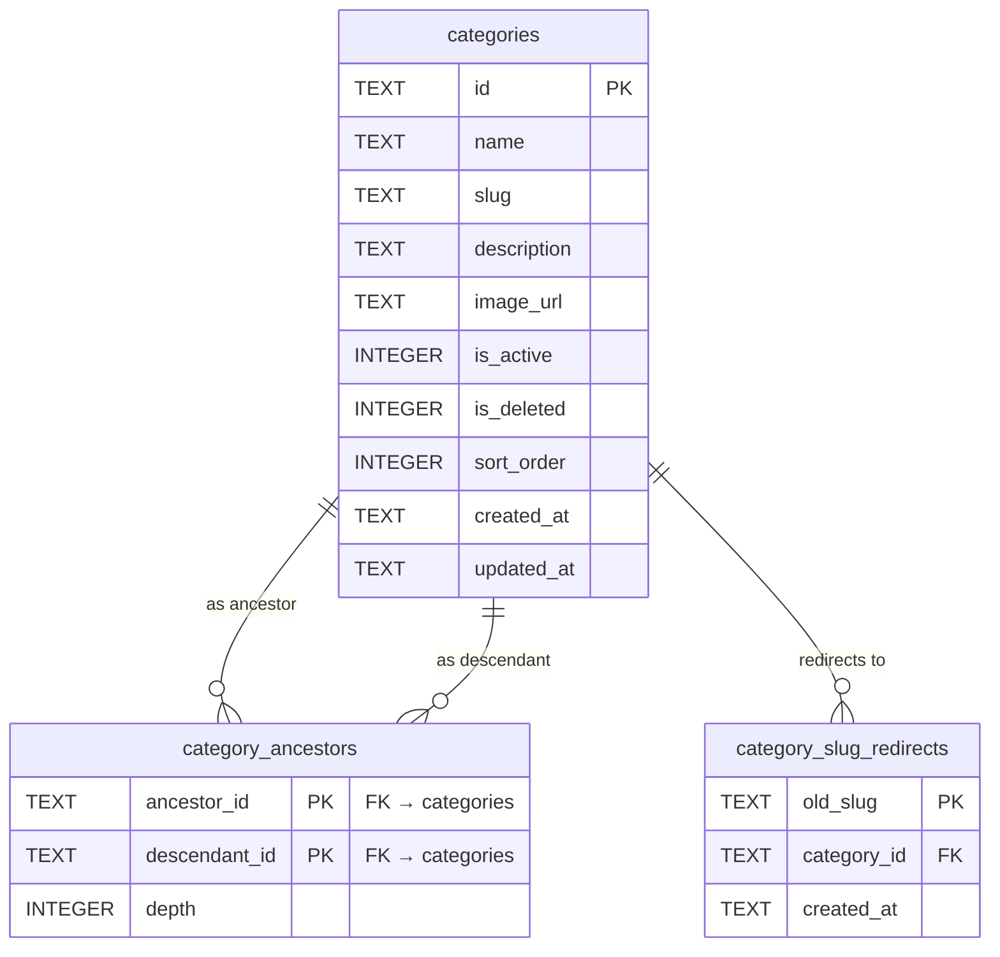

# 🏷️ Categories — Technical

Business reference: [categories.md](./categories.md)

---
---

## Technical

### Endpoints

| Method | Path | Access | Status |
|---|---|---|---|
| `POST` | `/categories` | `categories:create` | Done |
| `GET` | `/categories` | `categories:read` | Done |
| `GET` | `/categories/:id` | `categories:read` | Done |
| `PATCH` | `/categories/:id` | `categories:update` | Planned |
| `DELETE` | `/categories/:id` | `categories:delete` | Deferred |
| `PATCH` | `/categories/:id/parent` | `categories:update` | Deferred |

> `GET /categories` is an **admin view** — returns all non-deleted regardless of `is_active`. Public storefront endpoint is a future addition.

---

### DTOs

#### `CreateCategoryDto`

| Field | Type | Required | Notes |
|---|---|---|---|
| `name` | string | Yes | Display name |
| `slug` | string | Yes | Lowercase + hyphens — validated by regex |
| `description` | string | No | |
| `imageUrl` | string | No | |
| `sortOrder` | number | No | Defaults to `0` |

#### `UpdateCategoryDto`

All `CreateCategoryDto` fields optional, plus:

| Field | Type | Notes |
|---|---|---|
| `isActive` | boolean | Toggle storefront visibility |
| `parentId` | string UUID | Triggers re-parent logic |

#### `DeleteCategoryDto`

| Field | Type | Notes |
|---|---|---|
| `childAction` | `'deactivate'` or `'delete'` | Required when category has children |

---

### Create Category Flow



---

### Re-Parent Logic *(planned)*

When moving category **M** to a new parent **P**:



Internal subtree rows are untouched — depth is relative between two nodes, not absolute from root.

---

### Delete Category Flow *(deferred)*



---

### Database Schema



#### `categories`

| Column | Type | Notes |
|---|---|---|
| `id` | TEXT | UUID |
| `name` | TEXT | Display name |
| `slug` | TEXT | UNIQUE — occupied permanently once used |
| `description` | TEXT | nullable |
| `image_url` | TEXT | nullable |
| `is_active` | INTEGER | `0` / `1` — defaults to `0` on creation |
| `is_deleted` | INTEGER | `0` / `1` — one-way |
| `sort_order` | INTEGER | Sibling display order, defaults to `0` |
| `created_at` | TEXT | ISO timestamp |
| `updated_at` | TEXT | ISO timestamp, `null` until first update |

#### `category_ancestors` — Closure Table

| Column | Type | Notes |
|---|---|---|
| `ancestor_id` | TEXT | FK → categories(id) |
| `descendant_id` | TEXT | FK → categories(id) |
| `depth` | INTEGER | `0` = self · `1` = direct parent · etc. |

PK on `(ancestor_id, descendant_id)`. Every node has a self-reference row at depth 0.
Depth is **relative between two nodes** — not absolute from root. Re-parenting never needs to update depths within the moved subtree.

#### `category_slug_redirects` *(table exists, service logic deferred)*

| Column | Type | Notes |
|---|---|---|
| `old_slug` | TEXT | PK |
| `category_id` | TEXT | FK — redirect target |
| `created_at` | TEXT | ISO timestamp |

---

### Useful SQL Queries

#### Breadcrumb Path (all ancestors)

```sql
SELECT ancestor_id FROM category_ancestors
WHERE descendant_id = ?
ORDER BY depth DESC
```

#### Direct Children

```sql
SELECT c.*
FROM categories c
JOIN category_ancestors ca ON ca.descendant_id = c.id
WHERE ca.ancestor_id = ?
  AND ca.depth = 1
  AND c.is_deleted = 0
```

#### Full Subtree

```sql
SELECT descendant_id FROM category_ancestors
WHERE ancestor_id = ?
  AND depth > 0
```

#### Storefront-Visible *(future public endpoint)*

```sql
SELECT c.*
FROM categories c
WHERE c.is_active = 1
  AND c.is_deleted = 0
  AND NOT EXISTS (
    SELECT 1
    FROM category_ancestors ca
    JOIN categories anc ON ca.ancestor_id = anc.id
    WHERE ca.descendant_id = c.id
      AND ca.depth > 0
      AND (anc.is_active = 0 OR anc.is_deleted = 1)
  )
```

---

### File Structure

```
src/modules/categories/
├── categories.controller.ts
├── categories.service.ts
├── categories.module.ts
│
├── dto/
│   ├── create-category.dto.ts      name, slug, description, imageUrl, sortOrder
│   ├── update-category.dto.ts      + isActive, parentId
│   └── delete-category.dto.ts      childAction
│
└── permissions/
    └── categories.permissions.ts   CREATE, READ, UPDATE, DELETE
```

---

### Gotchas

**Slug Is Permanently Occupied** — `ensureSlugIsUnique` queries with no `is_deleted` filter. Even soft-deleted slugs block reuse. Planned: rename to `{slug}--deleted-{id}` on delete to free the slug.

**No Cascade on `category_ancestors`** — No `ON DELETE CASCADE` — categories are soft deleted, FKs always stay valid. Ancestor rows are cleaned up in code only during re-parent.

**`sort_order` Is Sibling-Scoped** — Order siblings by `sort_order ASC` among categories with the same direct parent (`depth = 1` from same ancestor).

---
---

## Planned

### Technical

- Implement `UpdateCategoryDto` with `isActive` and `parentId`
- Re-parent logic in service (closure table surgery, single transaction)
- Slug conflict handling for soft-deleted categories (`{slug}--deleted-{id}`)
- `category_slug_redirects` table writes on slug change and soft delete
- `DELETE /categories/:id` three-step guard
- `PATCH /categories/:id/parent` dedicated re-parent endpoint
- Test coverage for all categories endpoints
- Make `GET /categories` public (currently requires `categories:read` permission)
