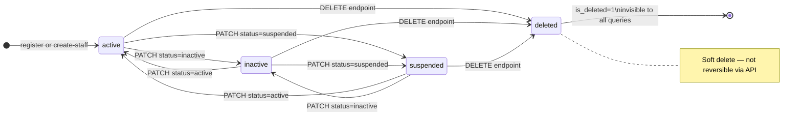

# 👥 Users — Business

Technical reference: [users.tech.md](./users.tech.md)

---
---

## Business

### What It Does

Manages user accounts. Two creation paths: **public self-registration** and **admin-gated staff creation**.
Full CRUD with soft delete — no user is ever hard deleted from the database.

---

### User Status Lifecycle

> `pending_verification` and `banned` exist in the DB but are not settable via API yet. See status table below.

---

### User Statuses

| Status | Can Log In | Settable via API | Notes |
|---|---|---|---|
| `active` | Yes | Yes | Default on creation |
| `pending_verification` | No | No | Reserved for future email verification flow |
| `inactive` | No | Yes | Deactivated by admin |
| `suspended` | No | Yes | Temporarily restricted |
| `banned` | No | No | Not yet exposed — manual DB only |
| `deleted` | No | No | Set by `DELETE /users/:id`, not PATCH |

Status validation on login lives in `UserValidationService` in the users module (`validators/user-validation.service.ts`).

---

### Creation Rules

- **Email** — normalized to lowercase. Uniqueness checked against non-deleted users only — a soft-deleted email can be re-registered.
- **Password** — hashed with `bcrypt` at 10 rounds. Never stored plain, never returned by any endpoint.
- **`created_by`** — `null` for self-registered users; set to `req.user.sub` for staff created by an admin.

---

### Update Rules

Only `email` and `status` can be updated via `PATCH /users/:id`.

- Email is normalized to lowercase. Uniqueness check excludes the user being updated so they can keep their own email.
- If no valid fields are provided → `400 No fields to update`.
- `updated_at` is always set on any successful update.

---

### Soft Delete

Sets `is_deleted = 1`, `deleted_at = now`, `updated_at = now`.
All `SELECT` queries filter `WHERE is_deleted = 0` — deleted users are completely invisible via the API and cannot log in.

---
---

## Planned

### Business

- **Role assignment via API** — currently only `superAdmin` can be seeded via script; no endpoint exists to assign roles to other users
- **`banned` status via API** — currently can only be set manually in the DB
