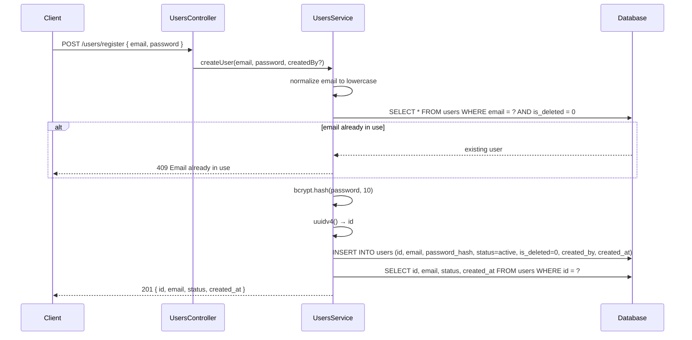
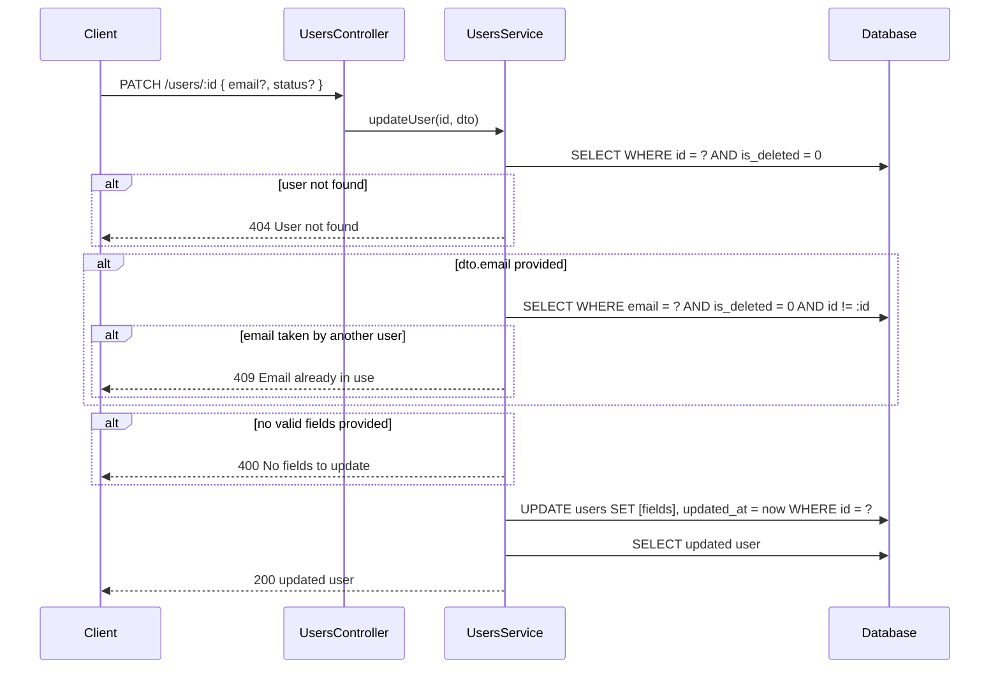

# 👥 Users — Technical

Business reference: [users.md](./users.md)

---
---

## Technical

### Endpoints

| Method | Path | Access |
|---|---|---|
| `POST` | `/users/register` | Public |
| `POST` | `/users/register-staff` | `users:create` |
| `GET` | `/users` | `users:read` |
| `GET` | `/users/:id` | `users:read` |
| `PATCH` | `/users/:id` | `users:update` |
| `DELETE` | `/users/:id` | `users:delete` |

---

### DTOs

#### `RegisterUserDto`

| Field | Type | Required | Notes |
|---|---|---|---|
| `email` | string | Yes | Must be valid email — normalized to lowercase |
| `password` | string | Yes | Min 6 characters |

#### `CreateUserDto` *(staff creation)*

Identical shape to `RegisterUserDto`. Separate class so staff creation can diverge independently.

| Field | Type | Required | Notes |
|---|---|---|---|
| `email` | string | Yes | Must be valid email — normalized to lowercase |
| `password` | string | Yes | Min 6 characters |

#### `UpdateUserDto`

| Field | Type | Required | Notes |
|---|---|---|---|
| `email` | string | No | Normalized to lowercase |
| `status` | string | No | Only `active`, `inactive`, `suspended` accepted |

---

### Create User Flow

Both `POST /users/register` and `POST /users/register-staff` call `createUser(email, password, createdBy?)`.



---

### Update User Flow



---

### Examples

#### `POST /users/register`

**Request:**
```json
{
  "email": "jane@example.com",
  "password": "secret123"
}
```

**201 — success:**
```json
{
  "success": true,
  "message": "User registered successfully",
  "data": {
    "id": "550e8400-e29b-41d4-a716-446655440000",
    "email": "jane@example.com",
    "status": "active",
    "createdAt": "2026-03-24T10:00:00.000Z"
  }
}
```

**409 — email taken:**
```json
{
  "success": false,
  "message": "Email already in use",
  "data": null
}
```

---

#### `GET /users/:id`

**Response 200:**
```json
{
  "success": true,
  "message": "User retrieved successfully",
  "data": {
    "id": "550e8400-e29b-41d4-a716-446655440000",
    "email": "jane@example.com",
    "status": "active",
    "createdAt": "2026-03-24T10:00:00.000Z",
    "updatedAt": null
  }
}
```

**404 — not found:**
```json
{
  "success": false,
  "message": "User not found",
  "data": null
}
```

---

#### `PATCH /users/:id`

**Request:**
```json
{
  "status": "inactive"
}
```

**200 — success:**
```json
{
  "success": true,
  "message": "User updated successfully",
  "data": {
    "id": "550e8400-e29b-41d4-a716-446655440000",
    "email": "jane@example.com",
    "status": "inactive",
    "createdAt": "2026-03-24T10:00:00.000Z",
    "updatedAt": "2026-03-24T11:30:00.000Z"
  }
}
```

**400 — nothing to update:**
```json
{
  "success": false,
  "message": "No fields to update",
  "data": null
}
```

---

### Database — `users`

| Column | Notes |
|---|---|
| `id` | UUID |
| `email` | Lowercase, unique among non-deleted |
| `password_hash` | bcrypt 10 rounds — never returned |
| `status` | See business doc for statuses |
| `is_deleted` | `0` / `1` |
| `deleted_at` | ISO timestamp, `null` until deleted |
| `created_by` | FK → users(id), `null` for self-registered |
| `created_at` | ISO timestamp |
| `updated_at` | ISO timestamp, `null` until first update |

**Fields returned to client:** `id · email · status · created_at · updated_at`

---

### File Structure

```
src/modules/users/
├── users.controller.ts
├── users.module.ts
├── users.service.ts
├── users.service.spec.ts
│
├── dto/
│   ├── register-user.dto.ts        { email, password }
│   ├── create-user.dto.ts          { email, password }
│   └── update-user.dto.ts          { email?, status? }
│
├── permissions/
│   └── users.permissions.ts        CREATE, READ, UPDATE, DELETE
│
└── validators/
    └── user-validation.service.ts  validateUserStatus
```

---

### Gotchas

**`findUserForLogin` Is Internal** — Used only by the auth module. Joins roles → permissions, returns `password_hash`. Not exposed via any controller.

**`findByEmail` Accepts `excludeId`** — Used for uniqueness checks on create and update. Pass `excludeId` to allow a user to keep their own email on update.

**No Role Assignment Endpoint** — Roles are assigned via `npm run seed:permissions` which assigns `superAdmin` to `SUPER_ADMIN_EMAIL`.

---
---

## Planned

### Technical

- `POST /users/:id/roles` or similar — endpoint to assign/remove roles from a user without relying on the seed script
- Expose `banned` status in `UpdateUserDto` once the business decision is made
- Complete Examples section — add DELETE example and 403 permission error case to existing examples
- Add cross-module dependency note — document that `AuthService` calls `UsersService.findUserForLogin` (internal, not exposed via controller)
